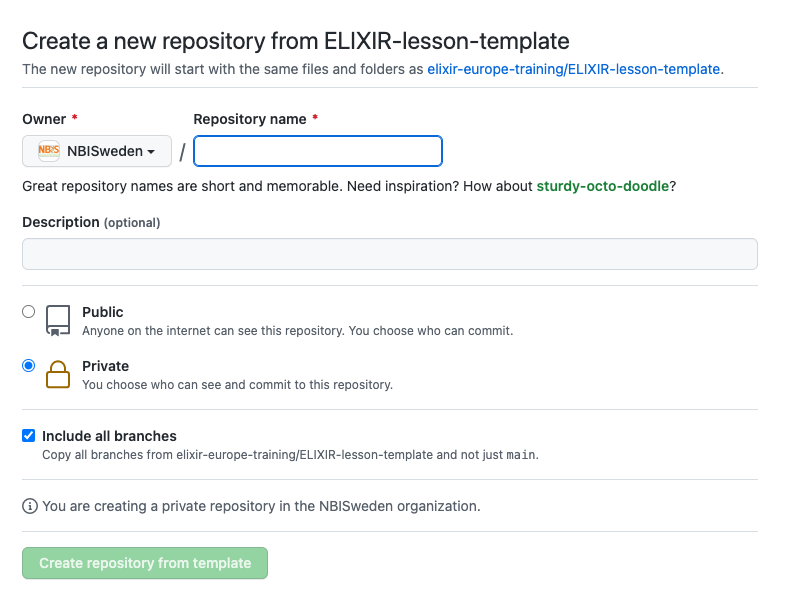
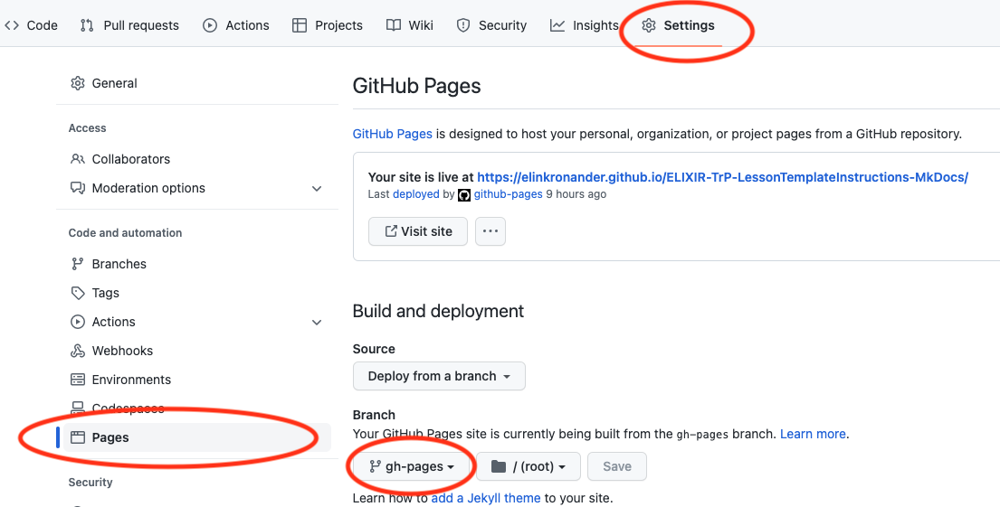
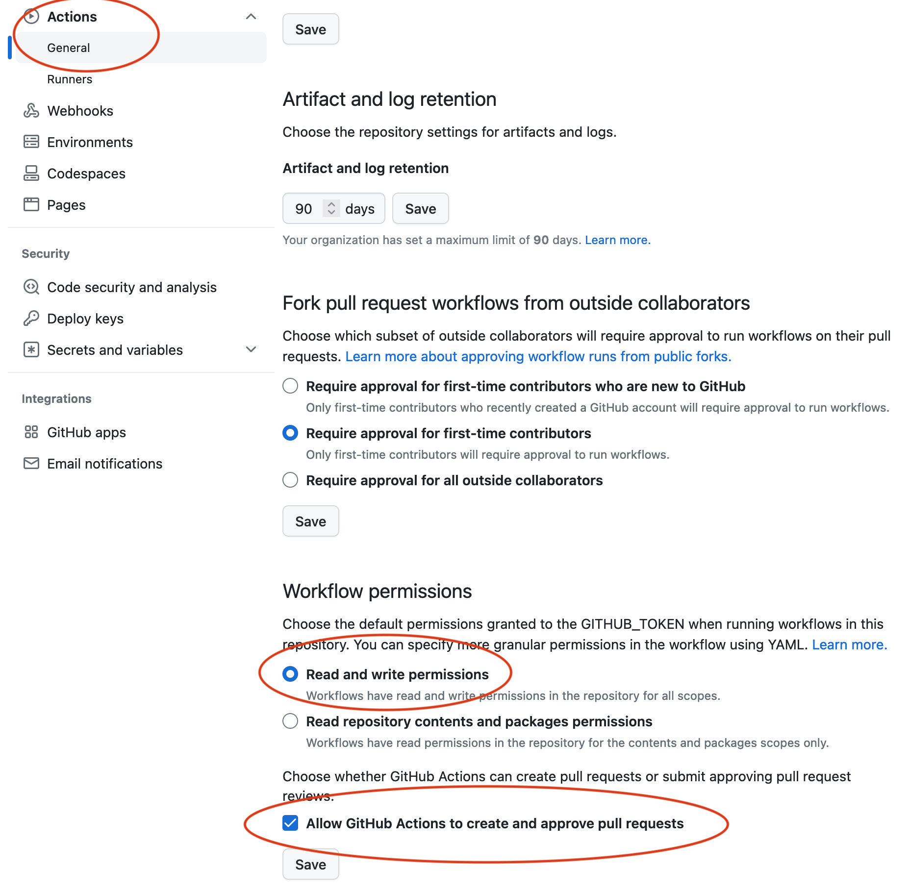
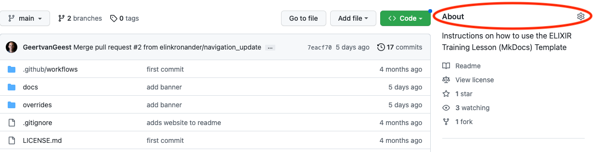
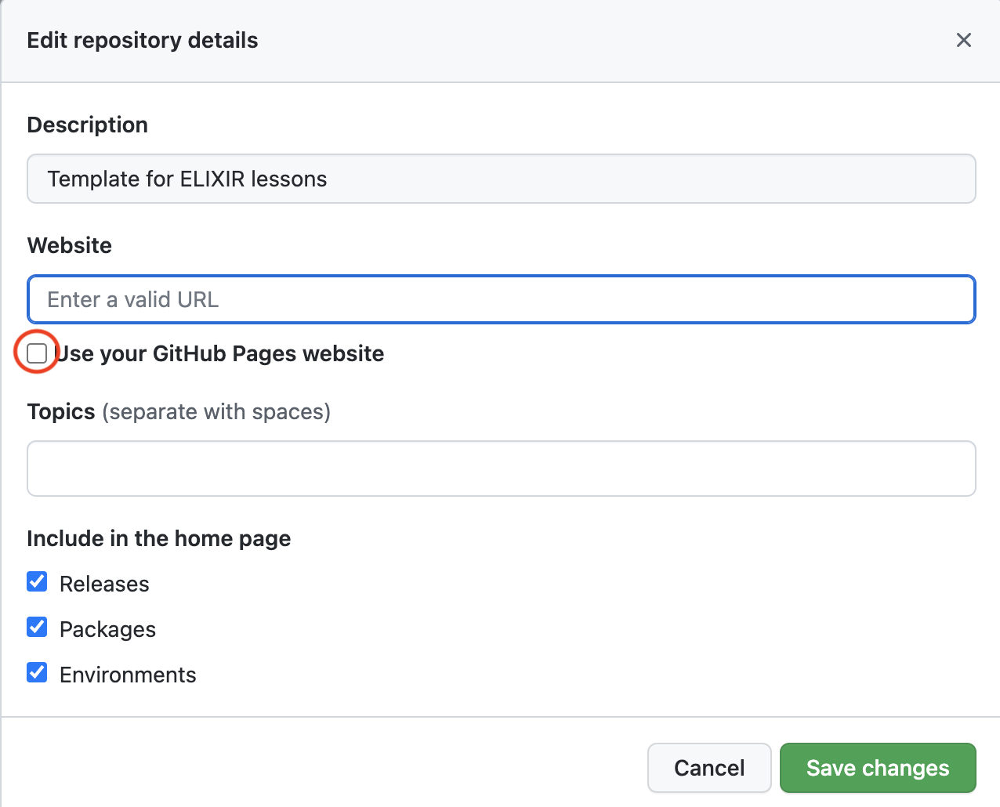

# How to set up a new repository based on the ELIXIR-TrP-LessonTemplate-MkDocs"

## 1.1 Creating a new repository
**Go to [https://elixir-europe-training.github.io/ELIXIR-TrP-LessonTemplate-MkDocs/](https://elixir-europe-training.github.io/ELIXIR-TrP-LessonTemplate-MkDocs/), then: **

#### 1.  Click the green `Use this template` button to the top right.
  
In the pop-up window:

   1. Choose an organisation where the repository will be hosted
   2. Enter a name for the new repository (keep in mind that this will be part of the URL)
   3. Decide if the repository should be Public (most likely) or Private
   4. Make sure to tick `Include all branches`
   5. Click **`Create repository from template`**

<figure>
    
</figure>

#### 2. Add collaborators
Go to settings and select `Collaborators and teams` under `Access` in the left side menu 

1. Click one of the green buttons `add people`  or `add teams`
2. Select a person or a team to invite
3. Selet the appropriate role 
4. Click `add user to this repository`

#### 3. Update the README.md
1. Go to the `<> Code` tab and click the README.md file
2. Add information about the new ELIXIR Lesson.

## 1.2 Using github actions to deploy gh-pages
#### 1. Go to settings and select `pages` in the left side menu
       
<figure>

</figure>

1. click on `None`under Branch and select the `gh-pages` branch
2. press `Save`

 When the site is deployed, it will take a few minutes, a box on top will display the url to the live site.

#### 2. Go to settings and select Actions -> General in the left side menu

<figure>

</figure>

1. at the top under `Actions permissions` check the option "Allow all actions and reusable workflows"     
2. scroll down to `Workflow permissions`and check the options "Read and Write permissions" + "Allow GitHub Actions to create and approve pull requests"

#### 3. Add URL to About section of the repository

1. Go to the `<> Code` tab and click the `About`settings wheel on the right side
    <figure>
  
    </figure>
2. In the pop-up `Edit repository details`: 
    1. tick the `Use your GitHub Pages website` to automatically fill the Website URL
    <figure>
  
    </figure>
    3. press `Save changes`

#### 4. Update site name, repository name and url in the mkdocs.yml file
1. Go to the `<> Code` tab and edit the mkdocs.yml file
2. Update the `site_name` tag at the top of the file to the name of your lesson.
3. Update the **Repository** section with the respective `repo_name`and `repo_url` of the lesson you have just created.
