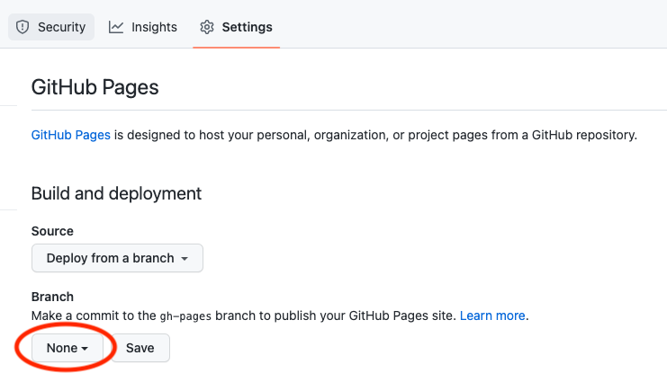

# How to set up a new repository based on the ELIXIR-TrP-LessonTemplate-MkDocs"

## 1.1 Creating a new repository
#### 1. Go to [https://github.com/elixir-europe-training/ELIXIR-TrP-lesson-template](https://github.com/elixir-europe-training/ELIXIR-TrP-lesson-template) 
1. click the green `use template` button to the top right and choose `Create a new repository`
2. In the pop-up 
<figure>

</figure>

    1. choose an organisation where the repository will be hosted
    2. choose a name for the new repository
3. add collaborators 
4. update README.md

## 1.2 Using github actions to deploy gh-pages
#### 1. Go to settings and select pages on the left side menu
       
<figure>

</figure>

1. click on `None`under Branch and select the `gh-pages` branch
2. press `Save`

 When the site is deployd, it will take a few minutes, a box on the top will display the url to th live site.

#### 2. Go to settings and select actions on the left side menu

<figure>

</figure>
    
1. scroll down to `Workflow permissions`
1. check the option "Read and Write permissions" 

#### 3. Add URL to About section of the repository

1. Go to the `<> Code` tab and click the `About`settings wheel on the right side
    <figure>
  
    </figure>
2. in the pop-up `Edit repository details`, tick the `Use your GitHub Pages website` to automatically fill the Website URL
    <figure>
  
    </figure>
3. press `Save changes`


#### 4. Update repository name and url in the mkdocs.yml file
``` yaml
#Repository
repo_name: elixir-europe-training/ELIXIR-TrP-LessonTemplateInstructions-MkDocs
repo_url: https://github.com/elixir-europe-training/ELIXIR-TrP-LessonTemplateInstructions-MkDocs
```