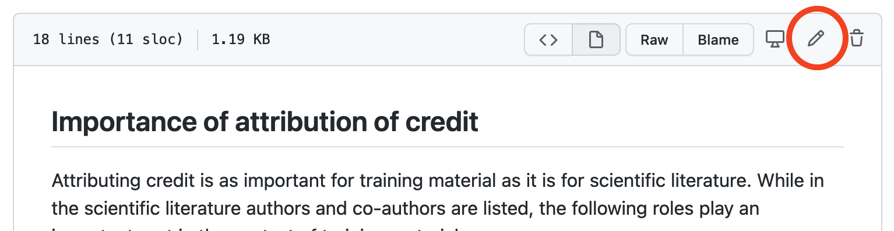
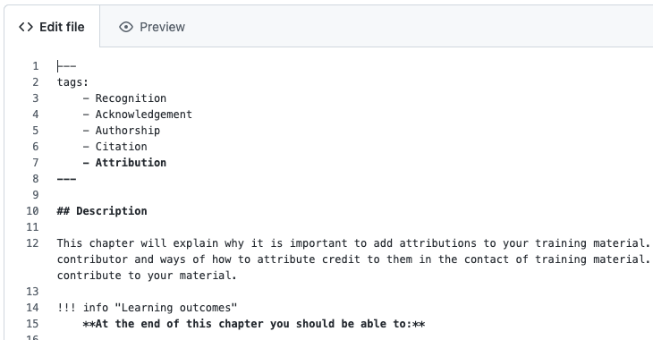
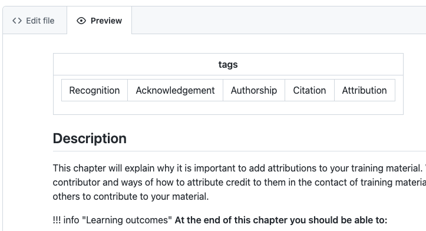
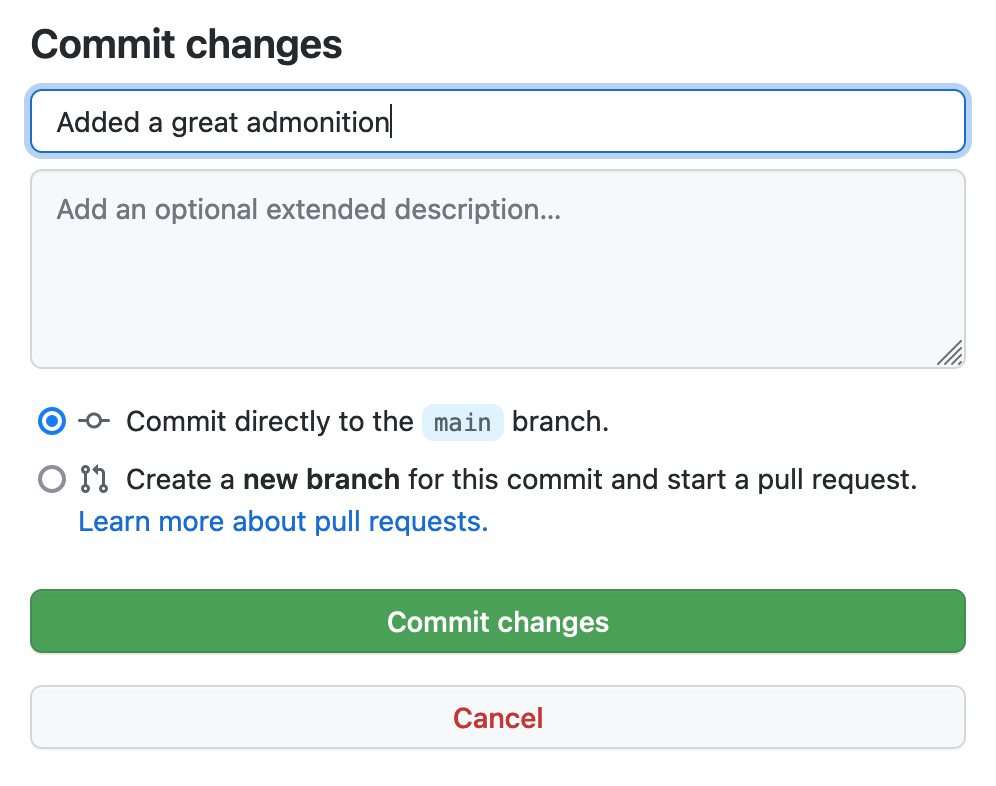

## Using the GitHub editor

First, you will need to be able to edit this repository. Ask for permissions at the repository admins. 

The content is written in markdown, [see tutorial](https://docs.github.com/en/get-started/writing-on-github/getting-started-with-writing-and-formatting-on-github/basic-writing-and-formatting-syntax) for reference, and can be edited directly in the browser by following these steps:

1. navigating to your chapter at `docs/chapters/` at the top of this page
2. clicking on your chapter's md file (e.g. `chapter_10.md`)
3. clicking on the **edit** buttion:


<figure>
  
</figure>

you can edit the markdown in the `<> Edit file` tab 
<figure>
  
</figure>

and review your changes by clicking the `preview` tab.
<figure>
  
</figure>


4. When you have finished, you can directly commit to the main branch. In order to do that, write a commit message that briefly describes your changes, and click the green button with **Commit changes**:

<figure>
  
</figure>

After commiting it will take ~30-60 seconds before the website is updated with your changes. The website URL can be found to the right on the first page of the repository. 

## Adding specific elements
In addition to adding text and other content in markdown, this template is based on the theme [material](https://squidfunk.github.io/mkdocs-material/) which has many fancy extensions, like [admonitions](https://squidfunk.github.io/mkdocs-material/reference/admonitions/) that can be used as well. 

### Authors
Add Authors manually to the index.md page.

### Boxed sections 
If you want to highlight some information you can make use of [admonitions](https://squidfunk.github.io/mkdocs-material/reference/admonitions/). 

Create a box by adding three exclamation marks `!!!` followed by the keyword `info` followed by the desiered title inside  quotation marks `"Title"`. The content of the block follows on the next line, indented by four spaces:

```
!!! info "Information"
    This box contains important information
```

!!! info "Information"
    This box contains important information

Boxed sections are also used for creating [Exercises](#Exercises).

### Code blocks
To call out a command or code within a sentence, use single backticks around the code. 
```markdown
To create a new line in the document press `Enter`.
``` 
will render this:
To create a new line in the document press `Enter`

To display example code into its own distinct block, use triple backticks ` ``` ` 
```markdown
  ``` 
  this is a basic code block example
  consisting of
  3 rows
  ```
``` 
For syntax highlighting, line numbers, titles etc. refer to the material [documentation](https://squidfunk.github.io/mkdocs-material/reference/code-blocks)

### Contributors
Add contributors manually to the index.md page.

### Exercises
In order to highlight exercises with expandable solutions you can make use of nested [boxed sections](#boxed-sections).
```
!!! example "Exercise"
    This is a question

    ??? success "Solution"
        this is the soluiton to the question
```

!!! example "Exercise"
    This is a question

    ??? success "Solution"
        this is the soluiton to the question

### Headings
In markdown, headings are created by adding one to six `#` followed by a space before your heading text. The number of `#` will indicate the level of the heading. The more you add, the smaller the heading will be.

To create a heading, add one to six # symbols before your heading text. The number of # you use will determine the size of the heading.
```markdown
# This is a heading 1
### This is a heading 3    
``` 

### Images

  If you want to add an image, the best way would be to use html, e.g:

    ```html
    <figure>
    
    <figcaption> Elixir image </figcaption>
    </figure>
    ```
    
Which would result in:

<figure>
    
    <figcaption> Elixir image </figcaption>
    </figure>

 If you want to use local images, add them to `docs/assets/images` and refer to them in the html as a relative path, e.g.:

    ```html
    <figure>
    
    <figcaption> Elixir image </figcaption>
    </figure>
    ```

Resulting in: 

<figure>
  
    <figcaption> Elixir image </figcaption>
    </figure>


### Links 

Inline links are created by wrapping link text in brackets `[ ]`, and then wrapping the URL in parentheses `( )` like this:

`This lesson template was built for [ELIXIR](https://elixir-europe.org/).`
This lesson template was built for [ELIXIR](https://elixir-europe.org/)

Linking to other pages follows the same prinicple but intstead of an URL, the relative path can be used, ie `[Chapter 1](/../../chapters/chapter_01) ` [Chapter 1](../../chapters/chapter_01/).

### Lists

You can make an unordered list by preceding one or more lines of text with <kbd>-</kbd>, <kbd>*</kbd>, or <kbd>+</kbd>. You will need to use the same

```markdown
- George Washington
* John Adams
+ Thomas Jefferson
```

- George Washington
* John adams
+ Thomas Jefferson

To order your list, precede each line with a number.

```markdown
1. James Madison
2. James Monroe
3. John Quincy Adams
```

1. James Madison
2. James Monroe
3. John Quincy Adams

You can create a nested list by indenting one or more list items below another item.
Type space characters in front of your nested list item, until the list marker character `-` or `*` lies directly below the first character of the text in the item above it.

```markdown
1. First list item
   - First nested list item
     - Second nested list item
```

### References

This website supports bibtex (pandoc style) by using the [bibtex plugin](https://pypi.org/project/mkdocs-bibtex/). In order to add a reference, add it in bibtex format to `references.bib` located in the main directory, cite it in your markdown document with `[@refid]`  and cite [@hoebelheinrich_nancy_j_2022_6769695] like this:

```
[@firstauthor_2022]
```


### Tables 

Tables are created with pipes `|` and hyphens `-`. Hyphens are used to create each column's header, while pipes separate each column. You must include a blank line before your table in order for it to correctly render. If you want to build large tables, have a look at [markdown tables generator](https://www.tablesgenerator.com/markdown_tables).

```yaml
---
| start 	| end   	| topic   	|
|-------	|-------	|---------	|
| 10:00 	| 10:30 	| coffee! 	|
| 12:00 	| 13:00 	| lunch!  	|
---
```

| start 	| end   	| topic   	|
|-------	|-------	|---------	|
| 10:00 	| 10:30 	| coffee! 	|
| 12:00 	| 13:00 	| lunch!  	|

### Authors cards

You can add social cards to a markdown document in two different ways:

**1. Write directly on the markdown file with URL or local image**

```
::cards::

- title: Zeus
  content: |
    [:custom-orcid:](https://orcid.org/) [:simple-github:](https://github.com/) [:simple-linkedin:](https://linkedin.com/)<br>
    Lorem ipsum dolor sit amet.
  image: https://raw.githubusercontent.com/Neoteroi/mkdocs-plugins-docs/main/docs/img/icons/001-zeus.png
  
::/cards::
```

**2. Create a yaml file with all the content**

You can create a yaml file with the content like this:

```
- title: Zeus
  content: |
    [:custom-orcid:](https://orcid.org/) [:simple-github:](https://github.com/) [:simple-linkedin:](https://linkedin.com/)<br>
    Lorem ipsum dolor sit amet.
  image: https://raw.githubusercontent.com/Neoteroi/mkdocs-plugins-docs/main/docs/img/icons/001-zeus.png
  
```

And then add to a markdown file like this:

```
[cards cols="3"(./docs/assets/cards/card_example.yaml)]
```

By default you can only provide 1 to 6 columns.

### Add videos

You can also embed videos from a local source (with a relative path) or from an url (like youtube). To use a youtube URL, 
just attach the ID of the video to a youtube embedded video link: `https://youtube.com/embed/`. For example, the Elixir training video `https://youtu.be/oAD8FdGf8tI` has the ID `oAD8FdGf8tI`, so the final link would be:

```

```


## Adding additional content

 For more advanced functionality, visit the [mkdocs material webpage](https://squidfunk.github.io/mkdocs-material/). For example for information on how to display [admonitions](https://squidfunk.github.io/mkdocs-material/reference/admonitions/). 

