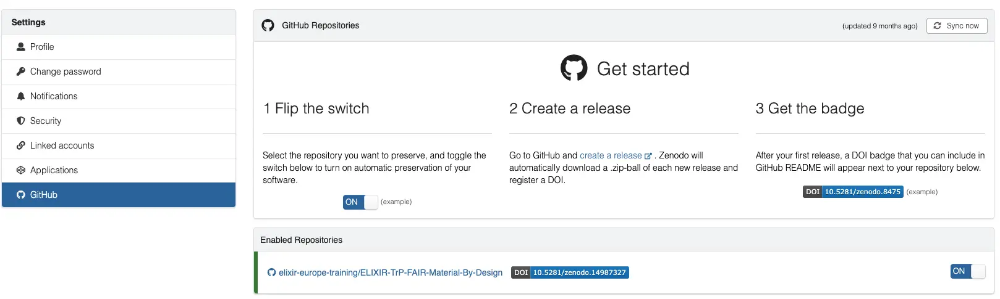

In order for authors and contributors to be recognized and get credit for their contributions to the training material they should be listed in the `About` page according to the instructions under [adding content](../chapters/chapter_03.md#adding-specific-elements). In addition, making use of persistent identifiers such as DOIs for the lesson itself and ORCIDs for authors and contributors is recommended. 

## DOIs using the Zenodo-GitHub integration

To issue a DOI for your lesson, you can make use of the [Zenodo-GitHub integration](https://docs.github.com/en/repositories/archiving-a-github-repository/referencing-and-citing-content#issuing-a-persistent-identifier-for-your-repository-with-zenodo). Zenodo archives your repository and issues a new DOI each time you create a new GitHub release which allows you to create permanent, citable versions of your lesson.

### Connect your GitHub repository to Zenodo

1. Go to [Zenodo](https://zenodo.org/) and create an account if you don't have one already. 
> By using the GitHub option so signup/sign in your Zenodo account will be connected to your GitHub account automatically. 
2. Click the down arrow next to your `username` in the top right corner to expand the menu,  select `GitHub`
> If you have not used your GitHub account to sign in to Zenodo sandbox select `Linked Accounts` first to connect your accounts
3. Once connected, you can selet the repository you want to issue a DOI for.

<figure>
  
</figure>

4. Find your repository in the list, toggle the switch to `ON`
> If your repository does not show up in the list, check when it was last synced in the title row of the first box and  click `sync now`if needed
5. Reload the page > your repository should now be added to the list of `Enabled Repositories`


### Prepare a .zenodo.json file
To provide the metadata for your lesson, you need to populate the `.zenodo.json` file in the root of your repository.

1. Copy the example file below and paste it into a the `.zenodo.json` file in the root of your repository.

``` { .json .copy }
{
    "title": "Training Material: Title of your lesson here",
    "description" : "Put a brief description of your material here. This should be a short summary of the content of your lesson.",
    "creators": [
        {
           "name": "Family Name, First Name",
            "orcid": "XXXX-XXXX-XXXX-XXXX",
            "affiliation": "Your institution",
            "type": "Author"
        },
        {
            "name": "Family Name, First Name",
            "orcid": "XXXX-XXXX-XXXX-XXXX",
            "affiliation": "Your institution",
            "type": "Author"
        }  
    ],
    "contributors": [
        {
            "name": "Family Name, First Name",
            "orcid": "XXXX-XXXX-XXXX-XXXX",
            "affiliation": "Your institution",
            "type": "Other"
        }
    ],
    "related_identifiers": [
        {
            "identifier": "https://doi.org/10.5281/zenodo.7913091",
            "relation": "isDerivedFrom",
            "resource_type": "software"
        }
    ],
    "keywords": [
        "FAIR", 
        "ELIXIR", 
        "training"
    ],
    "upload_type": "lesson",
    "language": "eng",
    "grants": [{"id":"1010101010"}] #if you have an EU grant that supports the devlopment you can provide the grant ID here
}
```

2. Paste the content into the `.zenodo.json` file in the root of your repository
3. Update the fields with the relevant information for your lesson. 
> The related_identifiers field can be expanded but please keep the information in the example file to indicate that your lesson is based on the ELIXIR lesson template.

4. Commit the changes to your repository.

5. If desired, add additional fields to the `.zenodo.json` file. You can find more information about these fields in the [Zenodo documentation](https://developers.zenodo.org/#add-metadata-to-your-github-repository-release).
> NB! Don't add a licence field to the `.zenodo.json` file. A licence will automatically be added to the Zenodo record based on the `LICENCE.md` file in the root of the repository.

### Create a release
To issue a DOI for your lesson, you need to create a release in your GitHub repository. This will trigger Zenodo to archive your repository and issue a DOI.

1. Go to your GitHub repository and click on the `Releases` on the right side menu of the `code`tab.
2. Click the `Draft a new release` button.
3. Click the `Choose a tag` button in the top left part of the page.
Enter a version name (e.g., `initial-release` - for the first version, `2024-09-Uppsala` - for the version of the lesson used in the course held in Uppsala September 2024)in the text field and click `+ Create new tag: on publish``
4. Fill in the `Release title` field with a short title (e.g., `First release of the lesson`).
5. Fill in the `Description` field with a description of the release (e.g., `This is the first release of <Title of your training material>.`).
6. Click the `Publish release` button.   
7. Return to your Zenodo > GitHub settings (see above) and inspect the list of `Enabled Repositories`. A black and blue DOI badge should now be available next to your repository name.

### Add the DOI badge to the repository 
1. Click the DOI badge next to your repository name in the Zenodo > GitHub settings.
2. A popup window will open with the DOI badge
3. Copy the Markdown formatted text.
4. Go to your GitHub repository and select the `README.md` file in the left side menu.
5. Click the pen in the top right corner to edit the file > paste the copied markdown text at the top of the file and commit the changes.

###

!!! tip "Try it out first"
    It might be useful to try out the integration using the [Zenodo Sandbox](https://sandbox.zenodo.org/) before you connect your lesson repository with Zenodo. This way you can test the process before issuing a real DOI. A step-by-step guide for using the Zenodo Sandbox is available in the [Training material made FAIR by desig
    n course](https://elixir-europe-training.github.io/ELIXIR-TrP-FAIR-Material-By-Design/chapters/chapter_08/#84-tutorial-for-implementing-your-strategy).


## Integrating ORCID iDs

ORCID has integrations with Zenodo which allows your works to be automatically added to your ORCID record. This means that when you create a Zenodo record for your lesson, it will also be added to your ORCID record if you have linked your Zenodo and ORCID accounts.

1. Go to [Zenodo](https://zenodo.org/) and log in to your account.
2. Click the down arrow next to your `username` in the top right corner to expand the menu, select `Linked Accounts`.
4. Click the `Connect` button next to the ORCID logo.
5. You will be redirected to the ORCID website to sign in and authorize Zenodo to access your ORCID profile.
6. Inform all the creators and contributors of your lesson that they can connect their ORCID accounts to Zenodo as well.
6. For each creator or contributor in your `.zenodo.json` file that has an ORCID id and set up this connection, Zenodo will automatically add the work to their ORCID record when you create a new release in your GitHub repository.